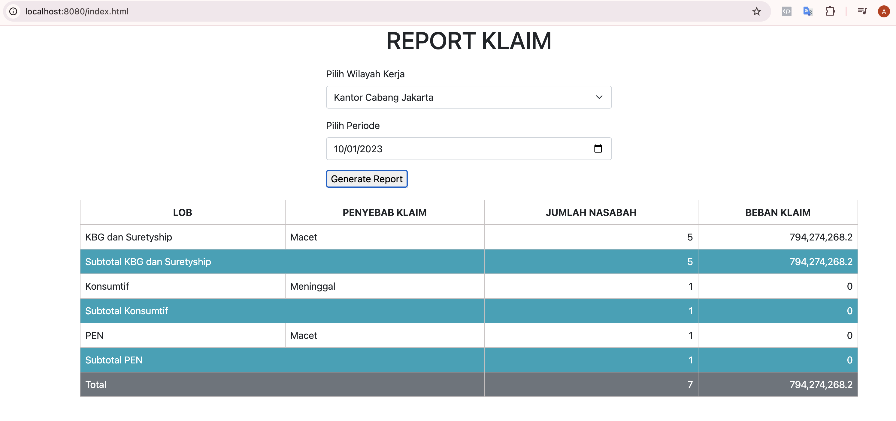

# jamkrindo-klaim# Jamkrindo Report Klaim

Database resourse docs/script.sql

Home page
http://localhost:8080/




API GET Rekap Klaim request
http://localhost:8080/klaim/rekap?idWilker=2&periode=2023-01-10

Response body:

```json

{
  "idWilker":2,
  "periode":"2023-01-10",
  "rekap":[
    {
      "subCob":"KBG dan Suretyship",
      "penyebabKlaim":"",
      "jumlahNasabah":5,
      "bebanKlaim":7.942742682E8
    },
    {
      "subCob":"Konsumtif",
      "penyebabKlaim":"",
      "jumlahNasabah":1,
      "bebanKlaim":0.0},
    {
      "subCob":"PEN",
      "penyebabKlaim":"",
      "jumlahNasabah":1,
      "bebanKlaim":0.0}
  ],
  "detail":[
    {
      "subCob":"KBG dan Suretyship",
      "penyebabKlaim":"Macet",
      "jumlahNasabah":5,
      "bebanKlaim":7.942742682E8
    },
    {
      "subCob":"Konsumtif",
      "penyebabKlaim":"Meninggal",
      "jumlahNasabah":1,
      "bebanKlaim":0.0
    },
    {
      "subCob":"PEN",
      "penyebabKlaim":"Macet",
      "jumlahNasabah":1,
      "bebanKlaim":0.0
    }
  ],
  "total":{
    "jumlahNasabah":7,
    "bebanKlaim":7.942742682E8
  }
}

```


API POST export data Klaim database aplikasi ke database penampungan
POST http://localhost:8080/klaim/export?periode=2023-01-31

Response body :

````json
{
"status": "Sukses",
"size": 47
}
````

